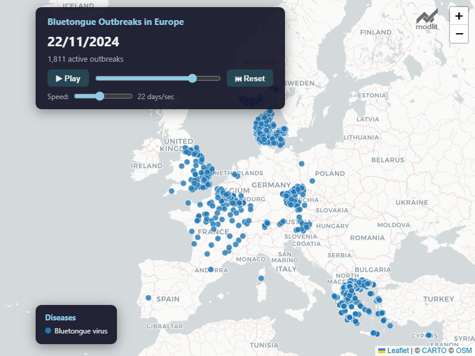

# WAHIS Report Retriever & Outbreak Animator

Automatically download publicly available animal disease reports from the World Organisation for Animal Health (WOAH) [WAHIS database](https://wahis.woah.org/#/event-management) and visualise outbreak spread over time with an interactive animated map.

> Originally by [Loic Leray](https://loicleray.com). Updated and maintained by [modlit](https://github.com/modlit). If this was of use to you, please consider acknowledging both contributors.

### Example: `build_animation.py` output



*Interactive Leaflet.js map generated by `build_animation.py` — animates outbreak spread day-by-day in the browser.*

---

## What's New (2026 Update by modlit)

The WAHIS platform underwent a major API overhaul. This fork has been fully reworked to restore functionality and add new features:

- **New API integration** — migrated from the legacy `/pi/` endpoints to the new `/api/v1/pi/` REST API, including updated headers, payload formats, and pagination
- **Cloudflare bypass** — uses `curl_cffi` with browser TLS fingerprint impersonation to avoid bot detection
- **Name-to-ID resolution** — translates human-readable country, disease, and region names into the numeric IDs the new API expects
- **Outbreak animation** — new `build_animation.py` script generates a lightweight, interactive Leaflet.js map that animates outbreak spread day-by-day in the browser
- **Streamlit dashboard** (optional) — `app_outbreaks.py` provides an interactive Streamlit app with play/pause controls and disease filters

---

## Project Structure

```
wahis/
├── report_retriever.py      # Main script: download WAHIS reports to Excel/CSV
├── build_animation.py       # Generate animated HTML map from downloaded data
├── app_outbreaks.py         # (Optional) Streamlit dashboard for interactive viewing
├── plot_outbreaks.py        # (Optional) Plotly-based static animation builder
├── plot_outbreaks_europe.py # (Optional) Plotly Europe-focused animation builder
├── requirements.txt         # Python dependencies
├── OUTPUTS/                 # Downloaded data and generated animations
│   ├── WAHIS_ReportOutbreaks_*.xlsx
│   ├── WAHIS_filter_options.json
│   └── outbreak_animation_europe.html
└── README.md
```

---

## Quick Start

### 1. Setup

```bash
python -m venv venv
venv\Scripts\activate        # Windows
# source venv/bin/activate   # macOS/Linux
pip install -r requirements.txt
```

### 2. Get filter options

See what countries, diseases, and regions are available:

```bash
python report_retriever.py -op
```

This saves `OUTPUTS/WAHIS_filter_options.json` with all available filter values.

### 3. Download outbreak data

You **must** specify a date range with `-sd` (start date) and `-ed` (end date) in `YYYY-MM-DD` format.

**Examples:**

```bash
# All Bluetongue reports from the last year
python report_retriever.py -d "Bluetongue virus (Inf. with) " -sd 2025-01-01 -ed 2026-02-12

# All reports for a region and date range
python report_retriever.py -r Europe -sd 2024-01-01 -ed 2026-02-12

# Multiple diseases in a specific country
python report_retriever.py -d "African swine fever virus (Inf. with) " "Foot and mouth disease virus (Inf. with) " -c France -sd 2020-01-01 -ed 2026-02-12
```

Data is saved as Excel spreadsheets in `OUTPUTS/WAHIS_ReportOutbreaks_*.xlsx` (one file per ~250 reports).

### 4. Generate animated map

After downloading data, build an interactive outbreak animation:

```bash
python build_animation.py
```

This creates `OUTPUTS/outbreak_animation_europe.html` — a self-contained ~0.6 MB HTML file you can open in any browser. Features:

- **Leaflet.js** map with OpenStreetMap/CARTO tiles (no API key needed)
- **Day-by-day animation** with Play/Pause/Reset controls
- **Adjustable speed** (1–50 days per second)
- **Cumulative display** — outbreaks appear on start date and disappear when end date passes
- **Hover popups** with location, country, disease, and dates
- **Colour-coded** by disease with a legend

### 5. (Optional) Streamlit dashboard

For an interactive dashboard with real-time disease filtering:

```bash
pip install streamlit
streamlit run app_outbreaks.py
```

---

## Filter Flags Reference

| Flag                       | Description                           | Example                              |
| -------------------------- | ------------------------------------- | ------------------------------------ |
| `-d` / `--disease`         | Filter by disease name(s)             | `-d "Bluetongue virus (Inf. with) "` |
| `-c` / `--country`         | Filter by country name(s)             | `-c France Germany`                  |
| `-r` / `--region`          | Filter by region                      | `-r Europe`                          |
| `-sd` / `--start_date`     | Start date (YYYY-MM-DD)               | `-sd 2024-01-01`                     |
| `-ed` / `--end_date`       | End date (YYYY-MM-DD)                 | `-ed 2026-02-12`                     |
| `-op` / `--output_options` | Save available filter options to JSON | `-op`                                |

**Note:** WAHIS disease naming includes trailing spaces and parenthetical annotations. Use the `-op` output to get the exact names.

---

## Dependencies

```
curl_cffi        # HTTP client with browser TLS fingerprint impersonation
openpyxl         # Excel file writing
pandas           # Data manipulation
tqdm             # Progress bars
```

Optional (for visualisation):

```
plotly           # Plotly-based maps (plot_outbreaks.py)
streamlit        # Interactive dashboard (app_outbreaks.py)
```

---

## Technical Notes

### API Details

The script communicates with the WAHIS API at `https://wahis.woah.org/api/v1/pi/`. Key endpoints:

- `POST /pi/event/filtered-list?language=en` — search and paginate outbreak events
- `GET /pi/review/report/{id}/all-information?language=en` — fetch full report details
- `GET /pi/country/list` — list all countries with IDs
- `GET /pi/disease/first-level-filters` — list all diseases with IDs

The API requires specific headers including `token`, `clientId`, and `env` fields. The script uses `curl_cffi` with Chrome TLS fingerprint impersonation to pass Cloudflare bot detection.

### Pagination

The filtered-list endpoint has a maximum `pageSize` of 2000. The script automatically paginates through all results.

---

## Credits

- Original author: [Loic Leray](https://loicleray.com) — reverse-engineered the original WAHIS API and built the report retriever
- Updated by: [modlit](https://github.com/modlit) — migrated to the new WAHIS v1 API, added Cloudflare bypass, outbreak animation, and Streamlit dashboard (2026)

---

## License

This tool retrieves publicly available information from WAHIS. Please be considerate and don't overload WOAH's servers. Acknowledge WOAH/WAHIS as the data source in any publications.
